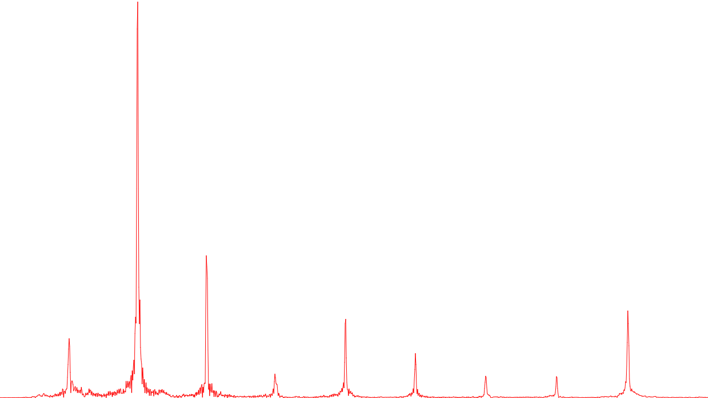

# spectral-sound

A really cursed tool I made to generate visuals for a project.

## What does it do?

The aim of this tool is to generate [spectral density](https://en.wikipedia.org/wiki/Spectral_density) plots for a given waveform. The implementation is ugly and the math is terribly un-rigorous, but it mostly works.

## How do I use it?

1. Compile `convert.c`.
2. Use a tool like Audacity to convert your input waveform into an uncompressed sound file consisting of 32-bit floats. Stereo tracks are not supported.
3. Run `convert` on the raw sound file, and pipe the output to `data.js`.
4. Open `dft.html`. Your plot will be generated.
5. Cry.

## Examples

This is the spectrum plotted for a G note played on the piano. Note the nice crisp overtones at multiples of the fundamental.

The spectrum of a slide whistle tuned to 875 Hz. Since it is essentially a closed-pipe resonator, it only displays odd harmonics. There is a peak at *n* = 3, around 2630 Hz.

A comparison of a piano's spectrum when the sustain pedal is held (red) or lifted (blue). The overtones are much more pronounced when the sustain pedal is lifted as other strings can sympathetically resonate with the original string when the sustain pedal is held.

